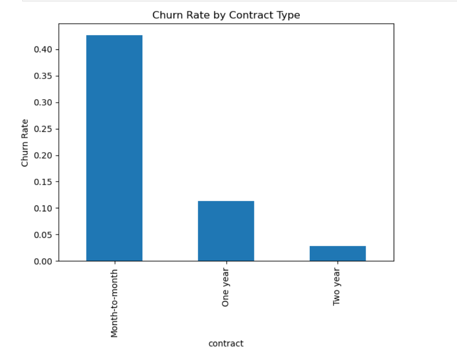

# Customer Churn Analysis & Retention Strategy (SQL + Python)

## 📌 Problem
Telecom companies lose customers (churn), which directly impacts revenue.  
This project analyzes customer data to identify key churn drivers and suggest strategies to reduce customer loss.

---

## 🛠️ Tools Used
- Python (Pandas, NumPy, Matplotlib, Seaborn)
- SQL (SQLite via Python)
- Jupyter Notebook

---

## 📂 Dataset
- Telecom customer dataset (Excel → CSV → Cleaned dataset)
- Includes customer demographics, contract type, charges, and churn status

---

## 🔍 Key Analysis Performed
### Exploratory Data Analysis (EDA)
- Cleaned and preprocessed raw data
- Analyzed churn distribution
- Studied relationship between:
  - Contract type and churn
  - Monthly charges and churn
  - Tenure and churn behavior

### SQL Analysis
- Calculated overall churn rate
- Performed contract-based churn segmentation
- Wrote queries for customer grouping and aggregation

---

## 📊 Key Insights (IMPORTANT)
- Customers on **monthly contracts** have significantly higher churn rates  
- Customers with **higher monthly charges** are more likely to churn  
- Customers with **longer tenure** show strong retention  

---

## 💡 Business Recommendations (THIS MAKES YOU STAND OUT)
- Encourage users to shift from monthly to long-term contracts (discount strategy)  
- Target high-charge customers with personalized retention offers  
- Focus retention campaigns on new customers (low tenure group)  

---

## 📈 Outcome
- Identified major factors influencing churn  
- Provided actionable strategies to improve customer retention  
- Built a strong foundation for predictive modeling  

---

## 🚀 How to Run
1. Clone the repository  
2. Open `eda_sql_analysis.ipynb`  
3. Run all cells  

---

## 📊 Sample Visualization

---

## 🔮 Future Work
- Build Power BI dashboard  
- Develop ML model for churn prediction  

---

## 👤 Author
Lovepreet  
B.Tech Computer Science & Engineering
